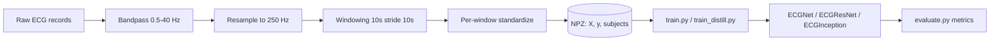
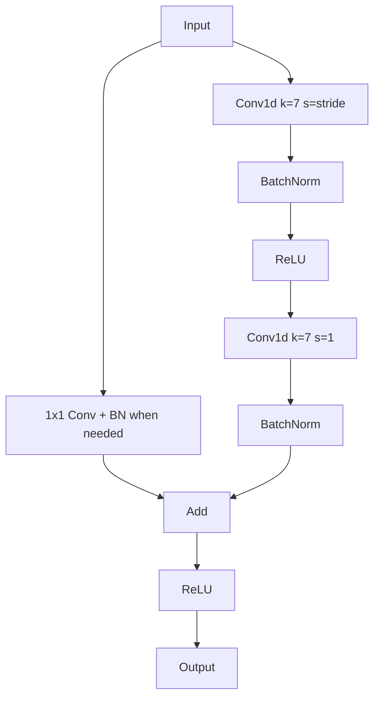

# Architecture And Data Specifications

This document summarizes the model structures, input formats, preprocessing, and reporting used in this repo.
All shapes below assume the default window length of 10 seconds at 250 Hz (T = 2500 samples).

## Input And Preprocessing

Signal preprocessing pipeline (all datasets):

| Step | Default | Implementation | Notes |
| --- | --- | --- | --- |
| Bandpass | 0.5-40.0 Hz, order 4 | `ecg_utils.bandpass_filter` | Butterworth + `filtfilt` |
| Resample | 250 Hz | `ecg_utils.resample_signal` | Polyphase via `resample_poly` |
| Windowing | 10s window, stride 10s | `ecg_utils.iter_windows` | Some datasets use 5s stride |
| Standardize | Per-window z-score | `ecg_utils.standardize` | `(x - mean) / (std + 1e-6)` |

Input tensor spec used by training/evaluation:

- dtype: `float32`
- shape (single-lead): `(batch, 1, T)`
- shape (multi-lead): `(batch, C, T)` where `C` is the number of leads
- range: standardized per window (roughly mean 0, std 1; no hard clipping)

### Dataset Outputs (NPZ)

| NPZ file | Script | Labels | X shape | Notes |
| --- | --- | --- | --- | --- |
| `data/processed/ecg_windows.npz` | `scripts/prepare_dataset.py` | NORMAL, MI, ARRHYTHMIA | `(N, T)` | MIT-BIH + NSRDB + PTBDB |
| `data/processed/ecg_windows_ptbxl.npz` | `scripts/prepare_ptbxl.py` | NORMAL, MI, ARRHYTHMIA | `(N, T)` | PTB-XL rules (loose/semi/strict) |
| `data/processed/ecg_windows_ptbxl_stage1.npz` | `scripts/prepare_ptbxl_twostage.py` | SINUS, ARRHYTHMIA | `(N, T)` | Stage 1 for two-stage inference |
| `data/processed/ecg_windows_ptbxl_stage2.npz` | `scripts/prepare_ptbxl_twostage.py` | NORMAL, MI | `(N, T)` | Stage 2 for two-stage inference |
| `data/processed/ecg_windows_ptbxl_stage2_12lead.npz` | `scripts/prepare_ptbxl_stage2_multilead.py` | NORMAL, MI | `(N, 12, T)` | Includes `lead_names` |
| `data/processed/ecg_windows_stage1_multi.npz` | `scripts/prepare_stage1_multi.py` | SINUS, ARRHYTHMIA | `(N, T)` | Multi-DB stage1, default stride 5s |
| `data/processed/ecg_windows_stage2_combo.npz` | `scripts/prepare_stage2_combo.py` | NORMAL, MI | `(N, T)` | PTB-XL + PTBDB, default stride 5s |

## Model Overview

Parameter counts (default 3-class head, 1 lead):

| Model | Params | Input | Output | Notes |
| --- | --- | --- | --- | --- |
| ECGNet | 52,483 | `(B, 1, 2500)` | `(B, 3)` | 3 conv blocks + GAP + linear |
| ECGResNet | 2,158,211 | `(B, 1, 2500)` | `(B, 3)` | 3 stages of 2 residual blocks |
| ECGInception | 389,763 | `(B, 1, 2500)` | `(B, 3)` | 2 Inception blocks, 4 branches each |

Input channels are inferred from the dataset:

- If `X` is 2D `(N, T)`, the model uses `in_channels = 1`.
- If `X` is 3D `(N, C, T)`, the model uses `in_channels = C`.

### ECGResNet-1D (Layer By Layer)

Residual block:

- Conv1d (kernel 7, stride s) -> BN -> ReLU
- Conv1d (kernel 7, stride 1) -> BN
- Optional downsample: 1x1 Conv + BN if `s != 1` or channels change
- Add skip + ReLU

Layer-by-layer output shapes for default input `(B, 1, 2500)`:

| Stage | Kernel / Stride | Channels | Output shape | Params |
| --- | --- | --- | --- | --- |
| Stem | 7 / 2 | 32 | `(B, 32, 1250)` | 320 |
| Layer1 (2 blocks) | 7 / 2 then 7 / 1 | 64 | `(B, 64, 625)` | 103,360 |
| Layer2 (2 blocks) | 7 / 2 then 7 / 1 | 128 | `(B, 128, 313)` | 411,520 |
| Layer3 (2 blocks) | 7 / 2 then 7 / 1 | 256 | `(B, 256, 157)` | 1,642,240 |
| GAP + FC | - | 256 -> 3 | `(B, 3)` | 771 |

### ECGNet (Baseline CNN)

| Layer | Kernel / Stride | Channels | Output shape |
| --- | --- | --- | --- |
| Conv1d | 7 / 2 | 32 | `(B, 32, 1250)` |
| Conv1d | 5 / 2 | 64 | `(B, 64, 625)` |
| Conv1d | 5 / 2 | 128 | `(B, 128, 313)` |
| GAP + FC | - | 128 -> 3 | `(B, 3)` |

### ECGInception (1D)

Each Inception module has 4 branches:

- 3x Conv1d with kernel sizes 9, 19, 39
- 1x MaxPool (k=3) -> 1x Conv1d

Default settings:

- `blocks=2`, `out_channels=32`
- Output channels per block: `4 * out_channels = 128`
- Output length unchanged (padding keeps T)

## Distillation (Teacher And Student)

Teacher model:

- Trained on `ecg_windows_ptbxl_stage2_12lead.npz`
- Input: `(B, 12, 2500)`

Student model:

- Trained on a single lead from the same windows
- Input: `(B, 1, 2500)`

```mermaid
flowchart LR
    A[12-lead window] --> T[Teacher model]
    A --> L[Select lead II (or index)]
    L --> S[Student model]
    T --> KD[KL loss (temperature)]
    S --> KD
    S --> CE[CE loss]
```

## Augmentation And Training Controls

Optional augmentations (`--augment`):

| Augmentation | Range | Applies to |
| --- | --- | --- |
| Amplitude scaling | 0.85-1.15 | 1-lead and multi-lead |
| Time shift | +/- (T / 20) samples | 1-lead and multi-lead |
| Gaussian noise | std 0.01-0.05 | 1-lead and multi-lead |
| Baseline wander | amp 0.02-0.1, freq 0.1-0.5 Hz | 1-lead and multi-lead |

Training controls:

- Optimizer: AdamW
- Loss: CrossEntropy (optionally with label smoothing)
- Sampling: optional weighted sampler (`--balanced-sampler`)
- Scheduler: optional cosine annealing (`--scheduler cosine`)

## Metrics And Performance Reporting

The repo prints metrics during training and evaluation, but does not store benchmark scores.
Use `scripts/train.py` and `scripts/evaluate.py` to produce results for your datasets.

| Metric | Where | Definition |
| --- | --- | --- |
| Accuracy | train/eval | `trace(cm) / cm.sum()` |
| Per-class accuracy | train/eval | `cm[i,i] / cm[i,:].sum()` |
| Balanced accuracy | train | Mean of per-class accuracies |

Example performance table (fill in after training):

| Model | Dataset | Accuracy | Balanced accuracy | Notes |
| --- | --- | --- | --- | --- |
| ECGNet | `ecg_windows.npz` | Not reported | Not reported | - |
| ECGResNet | `ecg_windows.npz` | Not reported | Not reported | - |
| ECGInception | `ecg_windows.npz` | Not reported | Not reported | - |

## Diagrams

Data pipeline (high level):



Residual block (conceptual):



LaTeX/TikZ sources (see `docs/figures/README.md` for compile instructions):

- `docs/figures/ecg_resnet1d_pytorch2tikz.tex` (3D layer-by-layer, generated via pytorch2tikz)
- `docs/figures/resblock_1d_nn_graphics.tex` (2D residual block, nn_graphics style)
- `docs/figures/classifier_head_nntikz.tex` (2D classifier head, nntikz style)
